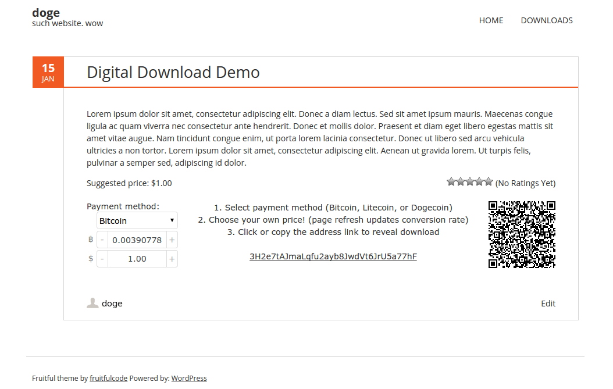

# Coinvert
Public domain cryptocurrency pay-what-you-want widget for digital downloads with custom number spinners and real-time conversion rates and QR-code generation. It was built for Bitcoin, Litecoin, and Dogecoin with conversions retrieved from the block.io API. 

Demo: <http://alotdog.github.io/coinvert/> (non-php/block.io version for static gh-pages branch with hard coded values)

### Clean/minimal number spinner
Looks good across browsers and allow you to type values, use the clicky buttons, and use the up/down keys to scroll quickly. Rel measurements and no images for scalability.

Screenshot:

### Issues
This is a very old project that existed mainly to help me learn git/github and DOM/styling (pre-boom). Besides being a mess of javascript and jQuery, there is precision loss when getting the conversion rate and the inability to have more than one widget. It should also have the click+hold to increment as well as dynamically created step sizes using the current amount to reflect crypto volitility.
I don't feel like revisiting this right now, but I might clean it up in the future.

---

License: Public Domain / Unlicense

Implements jquery.qrcode.js <https://github.com/jeromeetienne/jquery-qrcode> (MIT License)
